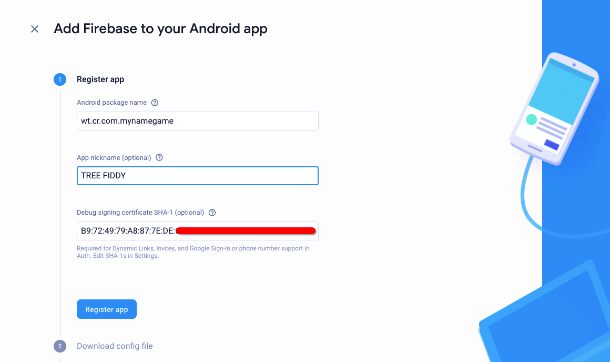
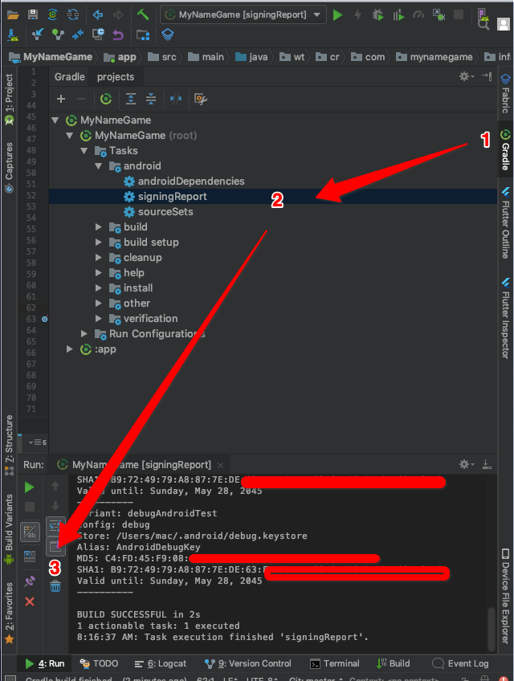
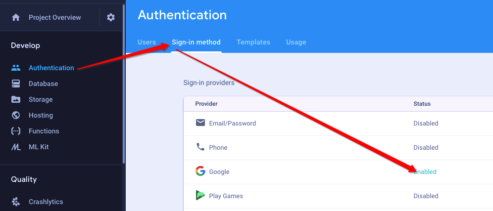

# Setup Instructions

## TL;DR
1. Add wt.cr.com.mynamegame to a firebase project
2. download the google-services.json
3. Add the downloaded file inside MyNameGame/app

## "Step by step"
1. Create/add a new project on the [Firebase Console](https://console.firebase.google.com/u/0/)

2. Find your SHA-1 signing cert

3. Download the config file
4. Add it to MyNameGame/app
5. Turn on Google Sign In inside Firebase console
 
6. Build/run the project

## Questions
-If you have any questions then create an issue or hit me up on [LinkedIn](https://www.linkedin.com/in/cory-rothert/)