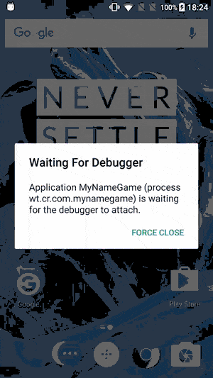

# MyNameGame

This is my version of the name game. The original template was written in Java and was over two years old.

## Outside Perspective
1. Turn on the game and press start (Green arrow)
2. Make a guess who you think matches the name at the bottom
3. Change modes at the top
4. View worldwide stats by clicking "VIEW HIGH SCORES" after successfully guessing someone
5. Insert your stats into the worldwide database 

## Inside Perspective
1. Uses Retrofit to call endpoint that returns JSON and it's formatted into POKOs (plain old kotlin objects)
2. Place six random people on the board using Groupie and RecyclerView
3. Listen for event clicks on the images or bottom group of buttons
4. Keep track of user's score via shared preferences
5. Keep track of worldwide scores via Firestore and allow users to opt-in

## Your mission //START// (criteria given)
Present the user with six faces and ask them to identify the listed name. To spruce things up, implement a few features of your choice.

1. Stat tracking. How many correct / incorrect attempts did the user make? How long does it take on average for a person to identify the subject?
2. Spruce up transitions and image loading.  Don't let images pop in and show the user that loading is happening
3. Game modes:
    * Mat(t) Mode. Roughly 90% of our co-workers are named Mat(t), so add a challenge mode where you only present the users with A Mat(t).
    * Reverse mode: Show one face with 5 names. Ask the user to identify the correct name.
4. Hint mode. As people wait, faces disappear until only the correct one is left.
5. Insert your own idea here!

## Your mission //END//

## The inside stuff: 
1. Kotlinn
2. MVVM / databinding
3. Groupie RecyclerView adapter
4. Splash Activity
5. Retrofit
6. RXJava
7. ObjectAnimator
8. AndroidSpinKit
9. SharedPreferences
10. Firestore for worldwide stats

## Android Stuff:
1. Gradle 3.2.1
2. Kotlin 1.2.71
3. Gradle Dist 4.10.2-all
4. Three activities (Splash, Home, Stats)

Original Question: https://github.com/willowtreeapps/namegame_android

### View1

### View2

### View3

### View4

